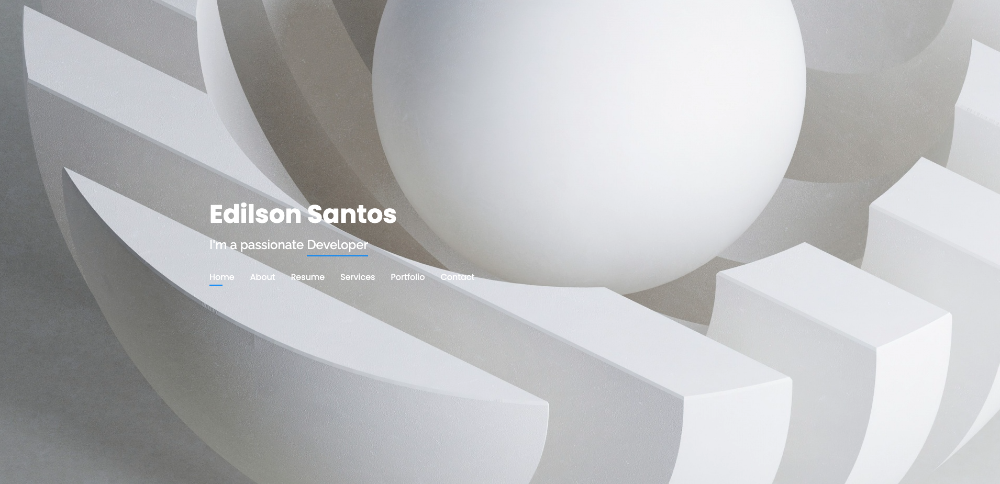

## Platform and product engineering

I build product and platform systems across Symfony, Node.js, Docker, MySQL, AI-assisted developer tooling, automation, and developer experience.

My public profile describes capability areas rather than private/internal project details. Some project names, repository links, architecture notes, and screenshots are intentionally omitted or summarized until they are safe to publish.

### Current focus areas

- **AI developer platforms:** MCP tooling, memory-backed workflows, Copilot/agent orchestration, and safe local automation.
- **Product engineering:** Marketplace, operations, workflow, and portfolio systems built with production-oriented practices.
- **Platform foundations:** Docker-based shared runtimes, Symfony/API Platform services, schema management, reverse proxy conventions, and deployment readiness.
- **Developer experience:** UI packages, template discovery, validation scripts, internal documentation, and reusable engineering workflows.
- **Reliability and observability:** Metrics, logs, traces, safe error handling, dashboards, and production-style diagnostics.

## My Tech Stack

## Portfolio

## Wall of self improvement
| Item | Current Stats |
| ------ | ------ |
| GitHub Streak |  |
| Code Wars |  |
